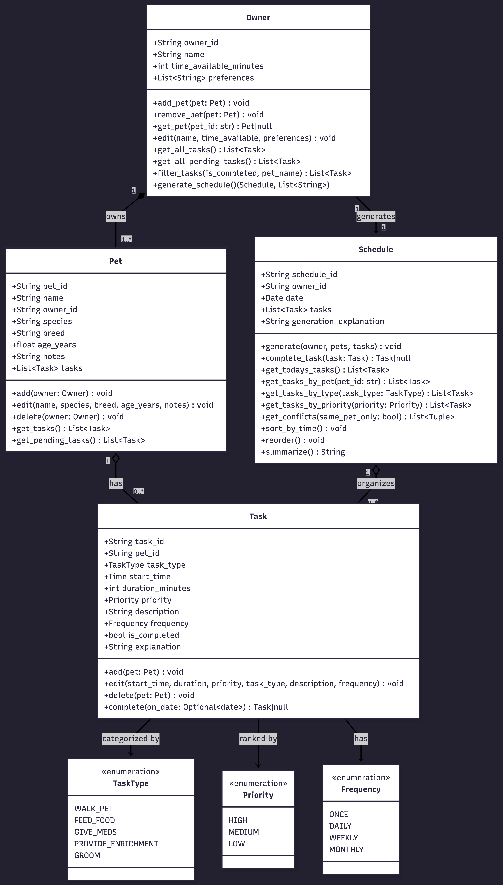

# PawPal+ (Module 2 Project)

You are building **PawPal+**, a Streamlit app that helps a pet owner plan care tasks for their pet.

## Scenario

A busy pet owner needs help staying consistent with pet care. They want an assistant that can:

- Track pet care tasks (walks, feeding, meds, enrichment, grooming, etc.)
- Consider constraints (time available, priority, owner preferences)
- Produce a daily plan and explain why it chose that plan

Your job is to design the system first (UML), then implement the logic in Python, then connect it to the Streamlit UI.

## What you will build

Your final app should:

- Let a user enter basic owner + pet info
- Let a user add/edit tasks (duration + priority at minimum)
- Generate a daily schedule/plan based on constraints and priorities
- Display the plan clearly (and ideally explain the reasoning)
- Include tests for the most important scheduling behaviors

## Getting started

### Setup

```bash
python -m venv .venv
source .venv/bin/activate  # Windows: .venv\Scripts\activate
pip install -r requirements.txt
```

### Suggested workflow

1. Read the scenario carefully and identify requirements and edge cases.
2. Draft a UML diagram (classes, attributes, methods, relationships).
3. Convert UML into Python class stubs (no logic yet).
4. Implement scheduling logic in small increments.
5. Add tests to verify key behaviors.
6. Connect your logic to the Streamlit UI in `app.py`.
7. Refine UML so it matches what you actually built.

## 🖥️ Sample Output

Today's Schedule
Schedule for 2026-06-26 — 6 task(s): 0 completed, 6 pending
  High: 4  Medium: 1  Low: 1
  [○] 07:00:00 | walk_pet | high | Morning walk
  [○] 07:30:00 | walk_pet | high | Morning walk
  [○] 08:00:00 | feed_food | high | Breakfast
  [○] 08:30:00 | feed_food | high | Breakfast
  [○] 16:00:00 | provide_enrichment | medium | Fetch and play session
  [○] 17:00:00 | groom | low | Brush coat

```
# e.g.:
# Daily plan for Biscuit (Golden Retriever):
#   08:00 — Morning walk (30 min) [priority: high]
#   09:00 — Feeding (10 min) [priority: high]
#   ...
```

## 🧪 Testing PawPal+

```bash
# Run the full test suite:
pytest

# Run with coverage:
pytest --cov
```

Sample test output:

```
========================================== test session starts ===========================================
platform darwin -- Python 3.13.13, pytest-9.1.1, pluggy-1.6.0
rootdir: /Users/richardvan/codepath_learning/ai110-module2show-pawpal-starter
plugins: anyio-4.14.1
collected 12 items                                                                                       

tests/test_pawpal.py ............                                                                  [100%]

=========================================== 12 passed in 0.01s ===========================================
```

### What the tests cover

**Baseline**
- A task starts as incomplete and becomes complete after calling `complete()`
- Adding a task to a pet increases that pet's task count by 1

**Recurrence logic**
- Completing a daily task returns a new task scheduled for the next day, with the same pet, type, and priority
- Completing a weekly task returns a new task scheduled 7 days later
- Completing a one-time task returns nothing — no follow-up is created

**Conflict detection**
- Two tasks whose time windows overlap are flagged as a conflict
- Two tasks that are back-to-back (one ends exactly when the next begins) are *not* flagged
- Overlapping tasks for different pets are suppressed when `same_pet_only=True`

**Sorting**
- A low-priority task at an earlier time is still ordered after a high-priority task at a later time
- Two tasks at the same priority level stay in chronological order relative to each other

**Schedule integrity**
- Completing a one-time task does not add anything to the schedule's task list
- `generate()` only includes tasks belonging to the pets passed in — tasks for other pets are excluded

## 📐 Smarter Scheduling

| Feature | Method(s) | Notes |
|---------|-----------|-------|
| Task sorting | `Schedule.reorder()`, `Schedule.sort_by_time()` | `reorder()` sorts by priority then start time; `sort_by_time()` sorts by start time only |
| Filtering | `Owner.filter_tasks()`, `Schedule.get_tasks_by_pet()`, `Schedule.get_tasks_by_type()`, `Schedule.get_tasks_by_priority()` | `filter_tasks()` filters by pet name and/or completion status; the `get_tasks_by_*` methods filter by pet, type, or priority |
| Conflict handling | `Schedule.get_conflicts()`, `Owner.generate_schedule()` | `get_conflicts()` detects overlapping time windows; `generate_schedule()` surfaces them as warning strings |
| Recurring tasks | `Task.complete()`, `Schedule.complete_task()` | `complete()` returns a new Task for the next occurrence (daily +1 day, weekly +7 days); `complete_task()` inserts it into the schedule automatically |


**Screenshot or video** *(optional)*: <!-- Insert a screenshot or link to a demo video here -->


### UML Diagram




## Features

### Schedule Generation (`Owner.generate_schedule()`)
Builds a daily schedule from all tasks across the owner's pets, then detects conflicts:
1. Collects all tasks from every pet the owner has
2. Creates a Schedule for today and populates it with those tasks
3. Sorts tasks by **priority first, then by time** (high-priority tasks always come before low-priority ones, regardless of clock time)
4. Detects overlapping time windows and returns warning messages for conflicts

### Task Recurrence (`Task.complete()`)
Implements recurring task logic when a task is marked complete:
- **DAILY tasks**: Automatically spawn a new identical task for tomorrow
- **WEEKLY tasks**: Spawn a new task 7 days later
- **ONCE/MONTHLY tasks**: Complete with no follow-up
- Returns the next Task object (or None if no recurrence)

### Conflict Detection (`Schedule.get_conflicts()`)
Identifies tasks whose time windows overlap:
- Converts start times + durations into absolute time ranges
- Compares all task pairs to find overlaps
- Two back-to-back tasks (one ending exactly when the next begins) are **not** flagged as conflicts
- Optional `same_pet_only` flag restricts conflicts to tasks for the same pet

### Task Filtering & Retrieval
Multiple methods support flexible querying:
- `Owner.filter_tasks()`: Filter by pet name and/or completion status
- `Schedule.get_tasks_by_pet()`, `get_tasks_by_type()`, `get_tasks_by_priority()`: Retrieve subsets by various dimensions
- `Pet.get_pending_tasks()`: Return only incomplete tasks for a pet
- `Owner.get_all_pending_tasks()`: Aggregate incomplete tasks across all pets

### Sorting Strategy
- **`Schedule.reorder()`**: Sorts by priority (HIGH → MEDIUM → LOW), then by start time within each priority level
- **`Schedule.sort_by_time()`**: Sorts by start time only, ignoring priority


## Demo

### UI Features

The Streamlit app provides an interactive interface for managing pet schedules:

- **Owner Profile**: Edit your name, available time per day (in minutes), and care preferences
- **Pet Management**: Add new pets with species, breed, age, and notes; edit or delete existing pets
- **Task Scheduler**: Add, edit, or delete tasks for each pet with type, time, duration, priority, and recurrence (ONCE/DAILY/WEEKLY/MONTHLY)
- **Daily Schedule View**: Generate and view today's complete schedule, sorted by priority then time
- **Conflict Warnings**: See alerts when tasks overlap or conflict with each other
- **Task Completion**: Mark tasks complete with automatic recurrence handling (daily tasks spawn tomorrow's task, weekly tasks spawn next week's, etc.)

### Example Workflow

1. **Create an owner profile**: Enter your name and how much time you have available each day
2. **Add pets**: Register your pets (e.g., "Buddy" the Golden Retriever, "Max" the Labrador)
3. **Schedule tasks**: Create recurring tasks for each pet
   - Buddy: 7:00 AM walk (30 min, HIGH priority, DAILY)
   - Buddy: 6:00 AM breakfast (10 min, HIGH priority, DAILY)
   - Max: 7:30 AM walk (30 min, HIGH priority, DAILY)
   - Max: 8:30 AM breakfast (10 min, HIGH priority, DAILY)
   - Max: 4:00 PM enrichment (15 min, MEDIUM priority, DAILY)
4. **View today's schedule**: Click "Generate Schedule" to see all tasks sorted by priority and time
5. **Check for conflicts**: The app flags any overlapping tasks (e.g., if both walks start at 7:00 AM)
6. **Mark tasks complete**: As you complete each task, the app automatically schedules recurring tasks for the next occurrence

### Key Scheduler Behaviors

**Priority-driven sorting**: High-priority tasks are always listed first, even if they're later in the day. A high-priority 5:00 PM task appears before a low-priority 8:00 AM task.

**Conflict detection**: Overlapping time windows trigger warnings. Back-to-back tasks (one ending exactly when another starts) are allowed.

**Recurring task creation**: Completing a DAILY task automatically creates an identical task for tomorrow. WEEKLY tasks spawn 7 days later. ONCE and MONTHLY tasks don't recur.

**Multi-pet scheduling**: Tasks for different pets are displayed together, allowing you to see your full daily load across all pets.

### Sample CLI Output

Running `main.py` produces a summary of today's schedule with conflict warnings:

```
WARNING: 'Morning walk' (Buddy, 07:00:00) overlaps 'Morning walk' (Max, 07:30:00)

Today's Schedule
Schedule for 2026-06-28 — 7 task(s): 0 completed, 7 pending
  High: 5  Medium: 1  Low: 0
  [○] 06:00:00 | feed_food | high | Breakfast
  [○] 07:00:00 | walk_pet | high | Morning walk
  [○] 07:14:00 | walk_pet | high | Morning walk
  [○] 07:30:00 | walk_pet | high | Morning walk
  [○] 08:30:00 | feed_food | high | Breakfast
  [○] 16:00:00 | provide_enrichment | medium | Fetch and play session
  [○] 17:00:00 | groom | low | Brush coat
```

Note: Tasks are sorted by priority (HIGH before MEDIUM/LOW), then by start time. The warning shows that two high-priority walks overlap in time.
